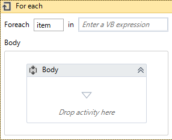

# Algorithm

## 概要

- 条件分岐、繰り返しなどのアルゴリズムの実装方法を解説。

## 条件分岐

- 条件分岐に関するアクティビティは下記の2種類がある。

名称|説明
----|----
Flow Decision|・フローチャート内での条件分岐を行う方法。 ・より大きな視点から条件を分けたい場合に適している。
If|・シーケンスに分岐する。 ・小さな分岐を行うのに便利。

### Flow Decicionアクティビティ

#### 概要

- フローチャート内に定義するタイプの条件分岐

#### アクティビティ図

#### プロパティ

プロパティ名|説明
------------|----
Condition|条件式を定義する。
Falselabel|`False`部分の説明
Truelabel|`True`部分の説明

### Ifアクティビティ

#### 概要

- シンプルな条件分岐に最適なシーケンスタイプのアクティビティ

#### アクティビティ図

#### プロパティ

プロパティ名|説明
------------|----
Condition|条件式を定義する。
Falselabel|`False`部分の説明
Truelabel|`True`部分の説明

## 変数への代入

### Assignアクティビティ

#### 概要

- 変数に値を代入するアクティビティ。
- アクティビティ内でまとめて変数を整理したいときに便利。

#### アクティビティ図

#### プロパティ

プロパティ名|説明
------------|----
DisplayName|表示名称
To|変数
Value|代入する値(変数も可)

---

## 繰り返しの制御

### アクティビティを戻す

#### 解説

- フローチャートで後ろのアクティビティに戻せば、無限ループに陥る。

#### イメージ図

### Do Whileアクティビティ

#### 解説

- `True`であれば、処理を戻す。
- `False`であれば、処理を進める。

#### アクティビティ図

#### プロパティ

プロパティ名|説明
------------|----
DisplayNmae|表示名称
Condition|条件式

### For Eachアクティビティ

#### 解説

- 複数の要素が入っている配列分、繰り返し処理を実行する。

#### アクティビティ図

#### プロパティ

プロパティ名|説明
------------|----
DisplayName|表示名称
TypeArgument|要素が入っている変数、コレクション
Values|変数

[Topへ](../)
