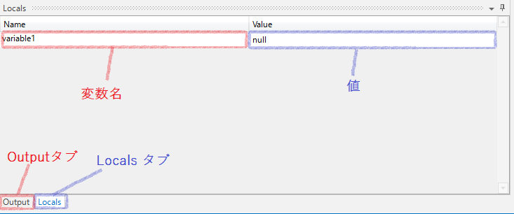

# Debug

## このページについて

- デバッグの方法を解説する。

## Debugモードの起動方法

- リボン > Execute > Debug
  - または[F7]ボタン

## 各種機能の説明

### 1. BreakPoints

- 特定の部分でロボットの動作を止める。

### 2. Step into/Step Over

- 一行ずつ実行する。
- 実行の仕方に下記のような違いがある。

Step into|Step Over
---------|---------
関数の呼び出しがある場合、*関数の中に入って実行*|関数の呼び出しがある場合、*関数呼び出しを1行として実行*

### 3. Slow Step

- ゆっくり実行する。

## Log Messageアクティビティ

### 解説

- ログに内部状態を出力させる。
- Logの出力先は、*ログファイル*か、実行中に登場する*Outputパネル*になる。
  - ログファイルの出力先は、`UiPath/Logs`配下になっている。
	- ログに出力すべきでない情報は`Private`で隠蔽することも可能

### アクティビティ図

### プロパティ

プロパティ|説明
----------|----
DisplayName|表示名称
Level|ログレベル
Message|出力メッセージ(変数の使用も可能)

## Localsタブ

- ローカル変数の状態をリアルタイムで参照することが可能。

[TOPへ](../)
