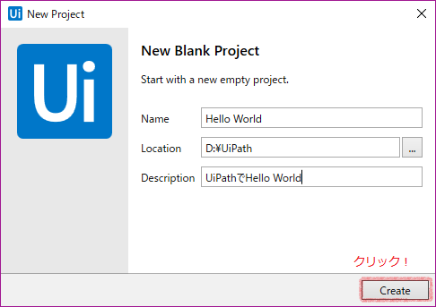
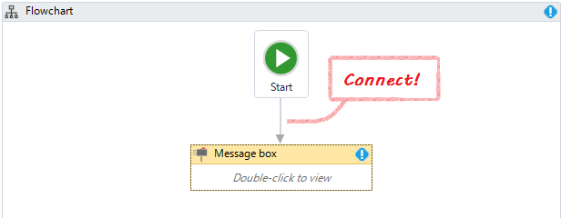
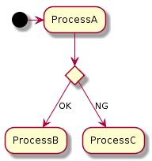
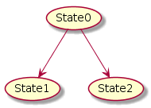
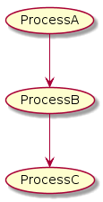
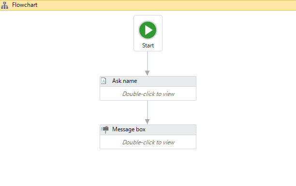

# HelloWorld

## このページについて

- 簡単なアプリケーションの作り方を解説する。

## 簡単にできる！HelloWorldロボットの作り方！

### 1. プロジェクトの作成

- 1-1. リボン > Start > Blankの順にクリック
- 1-2. 情報を入力し、[Create]ボタンをクリック
  - 下記の値を設定すること

プロパティ名|値
------------|--
Name| Hello World
Location| D:\\UiPath\\(任意の場所)
Description| UiPathでHello World

### 2. フローチャートの作成

- 2-1. アクティビティパネルからメインパネルに`Flowchart`アクティビティをドラッグ＆ドロップ
- 2-2. アクティビティパネルからメインパネルに`Message Box`アクティビティをドラッグ＆ドロップ
  - プロパティパネルで下記の値を設定する。

プロパティ名|値
------------|--
Content| "Hello! World"
Title| "Message From Robot"

- 2-3. アクティビティ同士を繋げる。
- 2-4. 実行する。

## 解説

### アクティビティ

- ロボットの動作は*アクティビティ*で定義する。
- アクティビティは、ロボットに設定可能な定義のすべてを含んでいる。
  - アクティビティパネルからドラッグ＆ドロップで追加する。

### ワークフロー

- UiPathでは、*ワークフロー*を*アクティビティ*の一種として登録ができる。

#### ワークフローの種類

名称|説明|イメージ図
----|----|---------
FlowChart|処理の遷移に注目したデザイン|
State Machine|状態の遷移に注目したデザイン|
Sequence|単純に、上から順に処理を行う。|

- ※ これらのワークフローは互いに入れ子にできる！

---

## HelloWorldロボットのパワーアップ

- 先ほど作成したHelloWorldロボットは、決まった値を表示するだけだったが、  
*変数*を使って、表示する値をカスタマイズできるようにする。

### 変数について

- UiPathでは*変数*を扱うことができる!
  - 大体、*いい感じ*に変数を扱ってくれる`Generic Value`という型が存在する。  
	(`Object`型のようなもの)

## 解説

### 1. プロパティの設定

- 1-1. 先ほど作成したHelloWorldロボットに`input Dialog`アクティビティを追加する。
- 1-2. 追加した`input Dialog`アクティビティのプロパティ値を下記のように設定する。
  - `Result`プロパティを設定する際、`Result`プロパティを右クリックし、`Create Variable`を選択。
  - `Variable Type`に、`String`を設定する。

プロパティ名|設定値
------------|------
Display Name|Ask Name
IsPassWord|False
Label|"Tell me your name"
Option|
Title|"Inpu into Robot"
Private|
Result|strMyName

- 1-3. `Message Box`アクティビティの`Context`プロパティを下記のように設定する。
  - "Hello! Wolrd!" → "Hello!" & strMyName

### 2. アクティビティの接続

- 2-1. 下記のようにアクティビティを接続する。

- 実行すると、*入力した値で挨拶をしてくれるようになる！*

[TOPへ](../)
