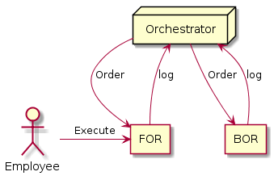

# OverView

## このページについて

- UiPathに関する概念や用語について解説する。

## 用語の説明

### ロボットの種類

名称|説明
----|----
Front Office Robot (FOR)|・従業員の端末にダウンロードされる。 ・従業員と共に働く。
Back Office Robot (BOR)|・サーバ内のVMで(も)動作する、 ・従業員の操作なしで動く。
Orchestrator|・FOR/BORを管理する。 ・BORとの連携により効果を発揮する。

- UiPath Studioは、そんな便利なロボットたちを設定するためのソフトウェア。

## 画面説明

- UiPathStudioの画面に関する説明を行う。

### 1. リボン

- ロボットの実行、新規ファイルなどの基本操作を行う。

- Start
  - 新規プロジェクトを作成するか、最近開いたプロジェクトから作業を開始する。
- Design
  - ファイル操作、よく使う機能のウィザード、変数の管理などワークフローを設定する機能にアクセスする。
- Execute
  - デバッグで使うメニュー。  
	デバッグに関する説明は[こちら](./Debug.html)
- Setup
  - 出来上がったロボットのパッケージング、機能拡張のインストールなど

[TOPへ](../)
