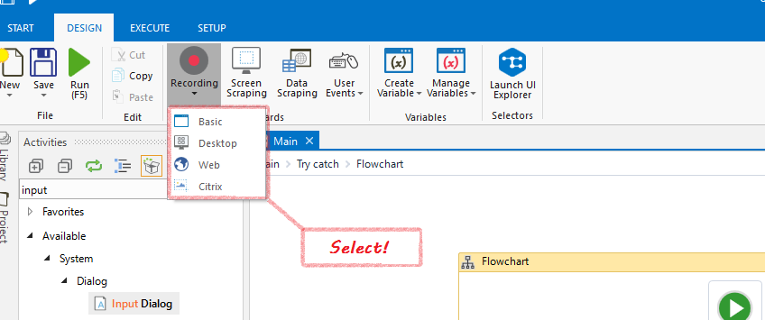
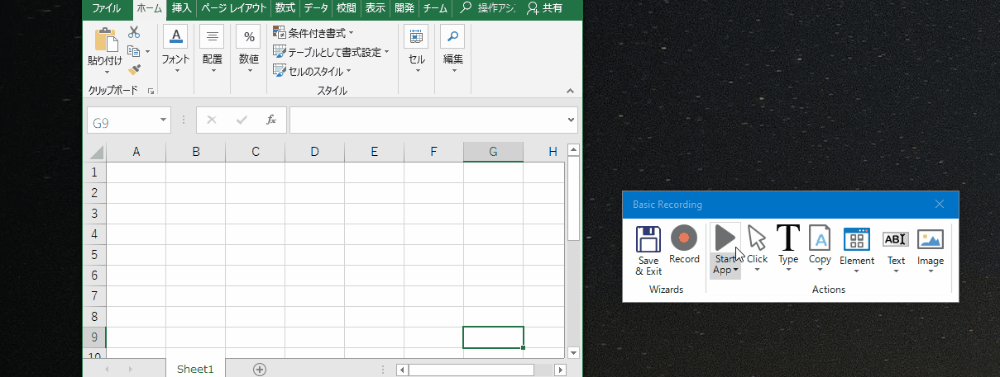
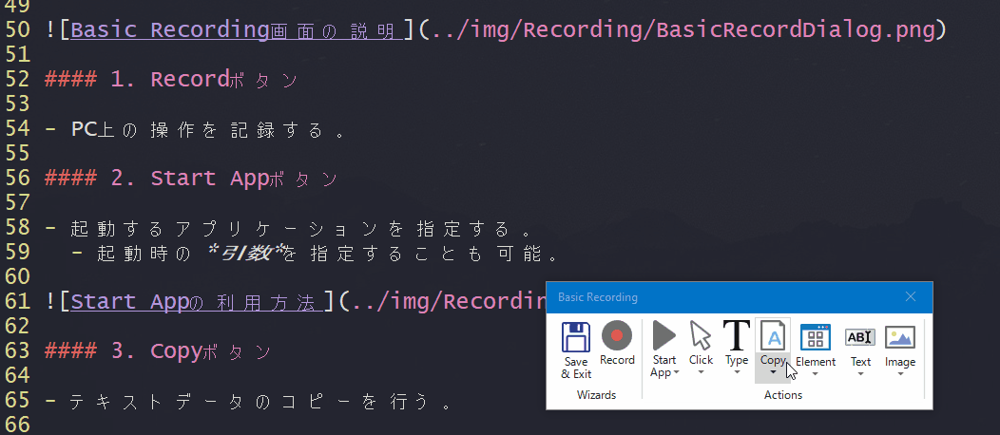

# Recording

## このページについて

- 作業の記録の仕方を解説する。

## What is Recording?

- ユーザがPC画面上で行った操作を自動的にアクティビティとして記録する手法。
- 使いこなすことによって、ロボットの設定時間を*大幅に短縮*することができる！

## UiPathにおけるRecording

- *実際にPCを操作して*、アクティビティを自動的に登録していく。
  - 他のRPAソフトウェアには、画面を動画として記録して操作を記録していくものもある。

## Recordingの流れ

- Recordingを開始する。
- PCを操作する。
- `Save & Exit`ボタンをクリックして、Recording結果を保存する。
  - Recording結果は、`Sequence`アクティビティとして、メインパネルに表示される。
	- `Sequence`アクティビティを、編集することも可能！

### 自動Recordingできる操作と手動Recordingしなければいけない操作

自動Recordingできる操作|手動Recordingしなければいけない操作
-------------------|--------------------
・左クリック ・文字入力|・ショートカットキー	・右クリック ・マウスHover	・テキストの取得 ・要素、画像の検索	・クリップモードへのコピー

## Recordingの種類

名称|説明
----|----
Basic Recording|・デスクトップアプリケーションをレコーディングする方法 ・*複数の*アプリケーションをまたいだ操作のレコーディングが可能
DeskTop Recording|・デスクトップアプリケーションをレコーディングする方法 ・*単一の*アプリケーションをまたいだ操作のレコーディング
Web Recording|・ブラウザ上の操作を自動化する。
Critix Recording|・リモートデスクトップなど、*Windows上でUI要素が認識されない*アプリケーションの自動化を行う。 ・`Selector`の概念はなく、操作対象領域の画像マッチで操作を記録する。

## Recordingの手順

### Recordingの開始方法

- リボンから*Recording*を選択し。記録したい内容を選択する。

### Recording画面の説明

#### 1. Recordボタン

- PC上の操作を記録する。

#### 2. Start Appボタン

- 起動するアプリケーションを指定する。
  - 起動時の*引数*を指定することも可能。

#### 3. Copyボタン

- テキストデータのコピーを行う。

##### テキスト取得のアクティビティ

- `Selector`プロパティで、取得するUI要素を選択することが可能。
  - Edit Attributes画面で要素の属性を編集することが可能。

## Basic Recording VS Desktop Recording

Basic Recording|Desktop Recording
---------------|-----------------
・アプリケーションの起動は単独のアクティビティとなっている (Start App) ・`Selector`は、アプリケーション名から定義されている。|・Record対象が、一つの画面のため、すべての操作が`Start App`内に定義されている。 ・`Selector`がシンプルになっている。

## Critix Recording

- 画像を認識して操作を登録する方法。
  - 画像の認識方法には下記の二種類が存在する。

名称|説明
----|----
テキスト|画像をOCRなどで、テキスト変換して指定したテキストが見つかった個所を操作する。 ※ 日本語フォントだとうまく動作しない場合がある。
画像|ドラッグ＆ドロップで指定した画像を登録し、指定した画像が見つかったところを基準とした場所を*座標*などを指定し操作する。

- 同じ文字や似た形があると誤動作する。

[TOPへ](../)
