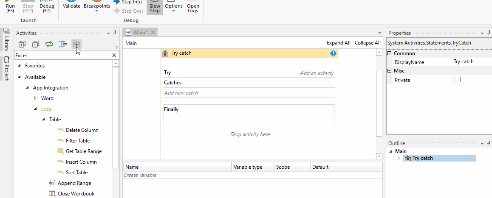

# Tools

## このページについて

- UiPathを効率的に使用するためのパッケージの紹介する。

## Excelの自動化

### `UiPath.Excel.Activities`の導入

1. アクティビティパネルからPackage Managerを起動する。
1. Package Managerウィンドウで、`UiPath.Excel.Activities`をインストールする。 

### `UiPath.Excel.Activities`のアクティビティ

アクティビティ|説明
--------------|----
Excel Application Scope|ワークブックを開く
Read Cell|セルを読み取る。
Write Cell|セルに書き込む。

### 繰り返しの方針

- Excelファイルの繰り返しの方針は下記の二つがある。
  1. ロボット側で読み取るセルを一つずつずらす。
  1. 読み込む際に、配列で読み込み[For Each文](./Algorithm.html#繰り返しの制御)で回す。

## ワードの自動化

### `UiPath.Word.Activities`の導入

1. アクティビティパネルからPackage Managerを起動する。
1. Package Managerウィンドウで、`UiPath.Word.Activities`をインストールする。 

### `UiPath.Word.Activities`のアクティビティ

アクティビティ|説明
--------------|----
Replace Text|文字を入れ替える。
Word Application Scope|Wordファイルを開く。

#### Replace Textアクティビティ

##### 解説

- Word書類の文字列を置換する。

##### アクティビティ図

##### プロパティ

プロパティ名|説明
------------|----
Replace|置換文字列
Search|検索文字列

## ブラウザの自動化

### Webレコーディング

- Recording > Webを選択する。
- ブラウザを指定する場合には、目的のサイトを開いた状態で、Open Browserでブラウザを開く指定をする。  
(Basic Recordingにおける`Start App`と同じ要領。)

## 表データのコピー

### データスクレイピング

- Scrape【自動】: こする
- 表のデータをまとめて取得する場合には、Copy > Scrape Dataで表形式のデータをコピーすることが可能。
- 取得したデータはDataTable型で保持される。

## PDFファイルの読み取り

### `UiPath.Pdf.Activities`の導入

1. アクティビティパネルからPackage Managerを起動する。
1. Package Managerウィンドウで、`UiPath.Pdf.Activities`をインストールする。 

### `UiPath.Pdf.Activities`のアクティビティ

アクティビティ|説明
--------------|----
Read PDF Text|*データとして*文字列をPdf文書の文字列を読み取る。
Read PDF With OCR|*OCR*としてPdf文書の文字列を読み取る。

#### `Read PDF With OCR`アクティビティで使用できるOCRについて

名称|説明
----|----
Google|白背景で精度が増す。 (Inverseオプションで精度が向上する。)
Microsoft|日本語にも対応している。

#### Read PDF Textアクティビティ

##### 解説

- 読み取り結果を`Text`として格納する。
- Textないから必要な情報のみを抜き出すには、[Matchesアクティビティ](#Matchesアクティビティ)を使用する。

##### アクティビティ図

##### プロパティ

プロパティ|説明
----------|----
DisplayName|表示名称
File Name|読み取りを行うPdfファイルのパス
Password|Pdfファイルのパスワード
Text|読み取り結果

#### Matchesアクティビティ

##### 解説

- Textデータから正規表現による抽出を行う。
- マッチしたパターンは`IEnumerable インターフェイス`で返却される。
  - パターンの取り出しは[For Each文](./Algorithm.html#繰り返しの制御)で一つずつ取得する。

##### アクティビティ図

##### プロパティ

プロパティ|説明
----------|----
DisplayName|表示名称
Input|入力データ
Pattern|正規表現
RegexOption|正規表現による抽出のルール
Result|正規表現による抽出の結果を格納する変数。

## Eメールの自動化

### `UiPath.Mail.Activities`の導入

1. アクティビティパネルからPackage Managerを起動する。
1. Package Managerウィンドウで、`UiPath.Mail.Activities`をインストールする。 

### `UiPath.Excel.Activities`のアクティビティ

アクティビティ|説明
--------------|----
Send SMTP Mail Message|SMTPでメールを送信するアクティビティ
GET POP3 Mail Message|POP3でメールを受信するアクティビティ

[TOPへ](../)
